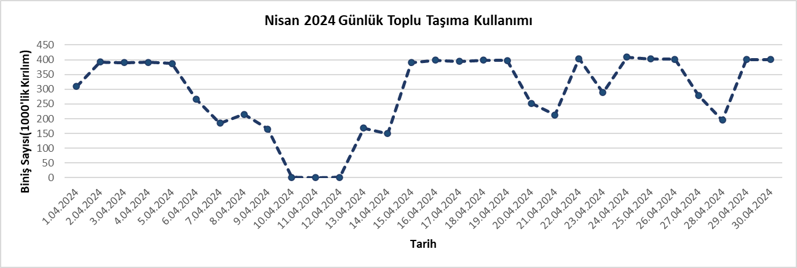
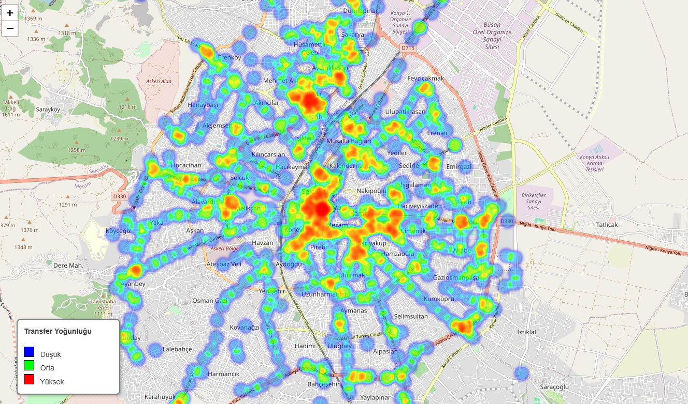

# 🚌 Konya Akıllı Kart Verisi Analizi

Bu proje, Konya iline ait toplu taşıma sisteminde kullanılan **akıllı kart** verileri üzerinden yapılan analizleri ve görselleştirmeleri içermektedir. Çalışma kapsamında günlük biniş sayılarına dayalı zamansal analizler ile birlikte, **transfer yoğunluklarına** göre hazırlanmış ısı haritası sunulmaktadır.

## 📅 Nisan 2024 Günlük Biniş Sayıları

Aşağıda, 1 Nisan – 30 Nisan 2024 tarihleri arasında akıllı kartla yapılan binişlerin günlük sayıları yer almaktadır:

### 📈 Biniş Sayısı Zaman Serisi Görselleştirmesi

Bu grafik, ay boyunca günlük biniş sayılarını göstermektedir. Özellikle hafta içi günlerinde biniş sayılarının daha yüksek, hafta sonları ve bayram tatili dönemlerinde (örneğin 10–12 Nisan) belirgin şekilde düştüğü görülmektedir.

---

## 🔁 Transfer Yoğunluğu Isı Haritası

Toplu taşıma ağında aktarma yapılan noktaların yoğunluğu aşağıdaki ısı haritası ile görselleştirilmiştir:

### Açıklama:

- **Kırmızı**: Yüksek transfer yoğunluğuna sahip merkezler (örneğin Zafer, Nalçacı, Meram çevresi).
- **Yeşil**: Orta seviye yoğunlukta transfer yapılan bölgeler.
- **Mavi**: Görece düşük yoğunlukta kalan, daha az transfer yapılan bölgeler.

Bu görselleştirme, **toplu taşıma planlamasında aktarma merkezlerinin optimizasyonu** ve **yoğunluk haritalarının analiz edilmesi** için önemli ipuçları sunar.

---

## 📌 Amaç ve Kullanım

Bu proje, Konya’daki toplu taşıma sisteminin:
- Günlük kullanım eğilimlerini izlemek,
- Tatil dönemlerinin etkisini değerlendirmek,
- Aktarma merkezlerinin konumsal yoğunluğunu analiz etmek

amacıyla hazırlanmıştır. Planlamacılar, karar vericiler ve ulaşım mühendisleri için değerli içgörüler sağlamayı hedeflemektedir.

---

## 🛠️ Kullanılan Araçlar

- Python (Pandas, Matplotlib, Folium)

